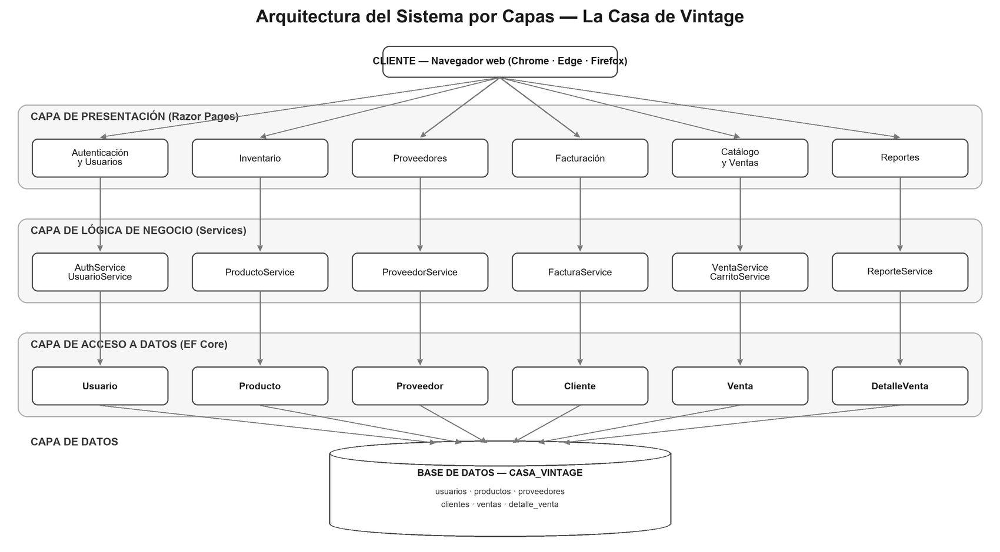

# Manual Técnico y de Sistema — La Casa de Vintage

## 1. Portada y control del documento

> Sección a completar por el autor (portada, versión, fecha, responsable, historial de cambios).

| Campo | Valor |
|---|---|
| Sistema | Sistema de Inventario y Ventas — La Casa de Vintage |
| Documento | Manual Técnico y de Sistema |
| Versión | (pendiente) |
| Fecha | (pendiente) |
| Autor | (pendiente) |

## 2. Introducción

Este manual documenta la construcción técnica del sistema tal como existe en el código fuente: arquitectura, modelo de datos, módulos, seguridad, flujos críticos, instalación y mantenimiento.

Alcance: cubre la aplicación web interna, su base de datos `CASA_VINTAGE` y su despliegue en un entorno local. No cubre procedimientos de negocio ni manual de usuario final.

Dirigido a: personal técnico y de soporte encargado de instalar, mantener, extender o diagnosticar el sistema.

Las descripciones se tomaron directamente del código (`Program.cs`, `appsettings.json`, `Data/`, `Models/`, `Services/`, `Pages/`, migraciones y seeder). Ante cualquier diferencia, prevalece lo que está implementado en el código.

## 3. Descripción general del sistema

Es un sistema web interno para una tienda física de antigüedades ("La Casa de Vintage", Lourdes, El Salvador). Reemplaza el registro manual de inventario y ventas. Lo usan únicamente empleados; no hay registro público ni catálogo para clientes en internet.

Roles de usuario: Administrador, Gerente, Vendedor, Contador. El vendedor opera el catálogo y el carrito a nombre del cliente de mostrador. Cada rol accede solo a los módulos que le corresponden, con autorización real en servidor.

Funcionalidad principal: autenticación por rol, gestión de usuarios/personal, proveedores, inventario/productos, catálogo con buscador, carrito y ventas en transacción única, facturación (comprobante PDF) y reportes con exportación a PDF y Excel.

## 4. Requisitos técnicos

Valores tomados de `CasaVintage/CasaVintage/CasaVintage.csproj` y `appsettings.json`.

### 4.1 Software

| Componente | Requisito |
|---|---|
| Framework | .NET 10 (`<TargetFramework>net10.0</TargetFramework>`) |
| Tipo de proyecto | ASP.NET Core Razor Pages (`Microsoft.NET.Sdk.Web`) |
| ORM | Entity Framework Core 10.0.9 (SqlServer + Design) |
| Base de datos | SQL Server, instancia local `CASTWINGS\SQLEXPRESS`, base `CASA_VINTAGE` |
| Autenticación de BD | Windows (Trusted_Connection) |
| Generación de PDF | QuestPDF 2026.7.0 (licencia Community) |
| Generación de Excel | ClosedXML 0.105.0 |
| IDE | Visual Studio 2022+ o VS Code con SDK de .NET 10; o CLI `dotnet` |
| Navegador | Cualquier navegador moderno |

Paquetes NuGet declarados:

- `ClosedXML` 0.105.0
- `Microsoft.EntityFrameworkCore.Design` 10.0.9
- `Microsoft.EntityFrameworkCore.SqlServer` 10.0.9
- `QuestPDF` 2026.7.0

Opciones del proyecto: `Nullable` habilitado, `ImplicitUsings` habilitado.

### 4.2 Hardware

No hay requisitos de hardware especiales declarados en el código. Basta un equipo capaz de ejecutar SQL Server Express y el runtime de .NET 10. La cadena de conexión asume que la instancia SQL Server y la aplicación corren en la misma máquina (`CASTWINGS`).

## 5. Arquitectura del sistema

La aplicación sigue una arquitectura en cuatro capas con inyección de dependencias y separación de responsabilidades (SOLID). Las PageModels solo orquestan; la lógica de negocio vive en la capa de servicios.

### 5.1 Capas

1. Presentación — Razor Pages: archivos `.cshtml` (vista) y su `PageModel` (`.cshtml.cs`) en `Pages/`. La PageModel valida la entrada, llama al servicio y arma el ViewModel. No contiene lógica de negocio.
2. Lógica de negocio — Servicios en `Services/` (interfaz + implementación). Contienen las reglas del dominio (validaciones, transacciones, cálculo de SKU, rentabilidad, etc.).
3. Acceso a datos — EF Core: `Data/CasaVintageContext.cs` (DbContext) y las entidades de `Models/`. El mapeo a columnas se define con Fluent API en `OnModelCreating`.
4. Datos — SQL Server, base `CASA_VINTAGE`, generada por migraciones code-first.

### 5.2 Flujo de una petición

1. El navegador solicita una página (por ejemplo, `/Inventario/Index`).
2. El middleware de autenticación lee la cookie `CasaVintage.Auth` y arma el `ClaimsPrincipal`; el de autorización comprueba el `[Authorize(Roles=...)]` de la página.
3. La PageModel (`IndexModel`) recibe la petición, valida la entrada y llama al servicio inyectado (por ejemplo, `IProductoService`).
4. El servicio consulta o modifica datos a través del `CasaVintageContext` (EF Core), que traduce a SQL contra `CASA_VINTAGE`.
5. El servicio devuelve un DTO/ViewModel; la PageModel lo asigna y devuelve la vista `.cshtml`, que se renderiza como HTML.

### 5.3 Justificación

- Separación de responsabilidades: la vista no conoce SQL ni reglas de negocio; el servicio no conoce HTTP.
- SOLID: interfaces por servicio (`IProductoService`, `IVentaService`, etc.) para desacoplar e inyectar.
- Inyección de dependencias: todos los servicios se registran en `Program.cs` con `AddScoped`.
- El DbContext cubre el patrón Unit of Work; no se usa repositorio genérico.

### 5.4 Diagrama de arquitectura



## 6. Estructura del proyecto

Raíz de la solución: `Intento 2/` (contiene el esquema de referencia `esquema_casa_vintage.sql`, la carpeta `docs/` y el proyecto). Proyecto: `CasaVintage/CasaVintage/`.

```
CasaVintage/CasaVintage/
  Program.cs                 Punto de entrada: DI, autenticacion, sesion, pipeline, migrate + seed
  appsettings.json           Cadena de conexion, logging, rutas de Facturas/Reportes, datos de la empresa
  appsettings.Development.json  Config del entorno de desarrollo (errores detallados y logging)
  CasaVintage.csproj         Target net10.0 y paquetes NuGet
  Data/
    CasaVintageContext.cs    DbContext + mapeo Fluent API de las 6 tablas
  Models/                    Entidades: Proveedor, Cliente, Usuario, Producto, Venta, DetalleVenta
  Services/                  Interfaces + implementaciones de la logica de negocio
  ViewModels/                Modelos para las vistas (no se exponen entidades crudas)
  Pages/                     Razor Pages por modulo (Cuenta, Personal, Proveedores, Inventario,
                             Catalogo, Carrito, Ventas, Reportes, Ajustes) + Shared/_Layout
  Migrations/                Migraciones EF Core que generan y versionan el esquema
  wwwroot/                   Recursos estaticos: css/, js/, uploads/ (productos, usuarios, marca)
```

Carpetas generadas en tiempo de ejecución (relativas a la raíz de la solución): `Facturas/` y `Reportes/`.

## 7. Modelo de datos

Fuente de verdad: las entidades de `Models/` y el mapeo Fluent API en `Data/CasaVintageContext.cs`. La base se llama `CASA_VINTAGE`. Seis tablas.

### 7.1 Diccionario de datos

Tabla `proveedores`:

| Columna | Tipo | Nulo | Descripción |
|---|---|---|---|
| id_proveedor | INT IDENTITY, PK | No | Identificador |
| nombre | varchar(60) | No | Nombre comercial |
| contacto | varchar(100) | Sí | Persona o medio de contacto |
| telefono | varchar(15) | Sí | Teléfono |

Tabla `clientes`:

| Columna | Tipo | Nulo | Descripción |
|---|---|---|---|
| id_cliente | INT IDENTITY, PK | No | Identificador |
| nombre | varchar(100) | No | Nombre para la factura |
| telefono | varchar(15) | Sí | Teléfono |
| correo | varchar(100) | Sí | Correo para el comprobante |

Tabla `usuarios`:

| Columna | Tipo | Nulo | Descripción |
|---|---|---|---|
| id_usuario | INT IDENTITY, PK | No | Identificador |
| nombre_usuario | varchar(60) | No | Nombre completo del empleado |
| correo | varchar(150) | No | Login por correo; único (UQ_usuarios_correo) |
| password | varchar(255) | No | Hash de la contraseña (IPasswordHasher) |
| rol | varchar(20) | No | Administrador, Gerente, Vendedor o Contador (CHECK) |
| activo | bit | No | Default 1; si es 0 se bloquea el acceso |
| fecha_creado | datetime | No | Default GETDATE() |
| foto | varchar(255) | Sí | Ruta de la foto de perfil en disco |

Tabla `productos`:

| Columna | Tipo | Nulo | Descripción |
|---|---|---|---|
| id_producto | INT IDENTITY, PK | No | Identificador |
| sku | varchar(30) | No | Código único autogenerado (UQ_productos_sku) |
| nombre | varchar(100) | No | Nombre |
| descripcion | varchar(max) | No | Descripción larga |
| epoca | varchar(50) | No | Época del artículo |
| estado | varchar(50) | No | Estado de conservación |
| precio | decimal(10,2) | No | Precio de venta (CHECK >= 0) |
| costo | decimal(10,2) | No | Costo de adquisición (CHECK >= 0) |
| stock | int | No | Existencias (CHECK >= 0) |
| stock_minimo | int | No | Default 0; nivel mínimo para alerta de stock bajo |
| disponibilidad | bit | No | Se sincroniza: disponibilidad = (stock > 0) |
| categoria | varchar(50) | No | Categoría |
| id_proveedor | int | No | FK a proveedores |
| foto1, foto2, foto3 | varchar(255) | Sí | Rutas de hasta 3 fotos en disco |
| fecha_registro | datetime | No | Default GETDATE() |
| row_version | rowversion | No | Token de concurrencia optimista |

Tabla `ventas`:

| Columna | Tipo | Nulo | Descripción |
|---|---|---|---|
| id_venta | INT IDENTITY, PK | No | Identificador |
| fecha | datetime | No | Default GETDATE() |
| id_cliente | int | No | FK a clientes |
| id_usuario | int | No | FK a usuarios (vendedor) |
| total_pagado | decimal(10,2) | No | Total cobrado |
| metodo_pago | varchar(20) | No | Efectivo o Tarjeta (CHECK) |

Tabla `detalle_venta`:

| Columna | Tipo | Nulo | Descripción |
|---|---|---|---|
| id_detalle | INT IDENTITY, PK | No | Identificador |
| id_venta | int | No | FK a ventas |
| id_producto | int | No | FK a productos |
| cantidad | int | No | Cantidad vendida (CHECK > 0) |
| precio_unitario | decimal(10,2) | No | Precio unitario al momento de la venta |

### 7.2 Relaciones y llaves foráneas

- `productos.id_proveedor` → `proveedores.id_proveedor` (FK_productos_proveedor).
- `ventas.id_cliente` → `clientes.id_cliente` (FK_ventas_cliente).
- `ventas.id_usuario` → `usuarios.id_usuario` (FK_ventas_usuario).
- `detalle_venta.id_venta` → `ventas.id_venta` (FK_detalle_venta).
- `detalle_venta.id_producto` → `productos.id_producto` (FK_detalle_producto).

Todas las FK usan `DeleteBehavior.Restrict` (no hay borrado en cascada; no se puede eliminar un registro referenciado).

### 7.3 Reglas de integridad

- SKU único: índice `UQ_productos_sku`. Correo de usuario único: `UQ_usuarios_correo`.
- CHECK de rol: `CK_usuarios_rol` = `rol IN ('Administrador','Gerente','Vendedor','Contador')`.
- CHECK de método de pago: `CK_ventas_metodo` = `metodo_pago IN ('Efectivo','Tarjeta')`.
- CHECK de valores no negativos: `CK_productos_stock` (stock >= 0), `CK_productos_precio` (precio >= 0), `CK_productos_costo` (costo >= 0).
- CHECK de cantidad: `CK_detalle_cantidad` (cantidad > 0).
- Concurrencia optimista: `productos.row_version` (rowversion, `IsRowVersion()`). Es la única tabla con token de concurrencia.
- Valores por defecto: `activo` = 1, `stock_minimo` = 0, `fecha_creado` / `fecha_registro` / `fecha` = GETDATE().

## 8. Módulos del sistema

Cada módulo indica: función, rol que lo usa, páginas Razor, servicio con la lógica y reglas de negocio. Los roles reflejan los `[Authorize(Roles=...)]` reales del código.

### 8.1 Autenticación

- Función: inicio de sesión por correo, cierre de sesión, bloqueo de cuentas inactivas y redirección al panel por rol.
- Rol: acceso anónimo al login; el resto de páginas exige autenticación (`AuthorizeFolder("/")`).
- Páginas: `Pages/Cuenta/Login`, `Pages/Cuenta/Logout`, `Pages/Cuenta/Denegado`.
- Servicio: `IAuthService` / `AuthService`.
- Reglas: la contraseña se verifica con `IPasswordHasher` (nunca texto plano); el bloqueo de cuentas inactivas se aplica solo después de validar la contraseña; mensaje genérico ante credenciales incorrectas y específico ante cuenta desactivada; anti-forgery en el formulario; redirección con `returnUrl` solo si es local.

### 8.2 Usuarios / Personal de la empresa

- Función: alta, edición, activar/desactivar y restablecer contraseña de empleados; vista tipo showcase del personal.
- Rol: Administrador.
- Páginas: `Pages/Personal/Index`, `Pages/Personal/Crear`, `Pages/Personal/Editar`.
- Servicio: `IUsuarioService` / `UsuarioService`; fotos con `IAlmacenArchivos`.
- Reglas: correo único (case-insensitive); contraseña hasheada; no se permite auto-desactivarse; no se puede dejar el sistema sin el último Administrador activo; "Eliminar" es desactivación (soft delete) porque las ventas referencian al usuario; "Restablecer contraseña" = el Administrador escribe una nueva (no hay recuperación por correo).

### 8.3 Proveedores

- Función: CRUD de proveedores.
- Rol: Administrador, Gerente.
- Páginas: `Pages/Proveedores/Index`, `Crear`, `Editar`.
- Servicio: `IProveedorService` / `ProveedorService`.
- Reglas: no se puede eliminar un proveedor que tenga productos (FK Restrict); la tabla no tiene columna de estado, por lo que no hay soft delete.

### 8.4 Inventario / Productos

- Función: CRUD de productos con SKU, hasta 3 fotos, costo, y sincronía stock/disponibilidad.
- Rol: Administrador, Gerente.
- Páginas: `Pages/Inventario/Index`, `Crear`, `Editar`.
- Servicio: `IProductoService` / `ProductoService`; fotos con `IAlmacenArchivos` (subcarpeta `productos`).
- Reglas: SKU autogenerado con formato `VIN-####`; `disponibilidad = (stock > 0)` en cada alta/edición; validación de proveedor existente; no se puede eliminar un producto con ventas asociadas (FK Restrict); el reabastecimiento se hace subiendo el stock en la edición.

### 8.5 Catálogo

- Función: cuadrícula de productos, hero rotativo, filtros (categoría, época, estado), buscador AJAX, ficha de detalle con galería, y "Agregar al carrito".
- Rol: Administrador, Gerente, Vendedor. El Administrador y el Gerente pueden ver el catálogo pero no vender: el botón "Agregar al carrito" solo se muestra al Vendedor y el handler de agregar está restringido a Vendedor en el servidor.
- Páginas: `Pages/Catalogo/Index`, `Pages/Catalogo/Detalle`.
- Servicio: `IProductoService` (métodos de catálogo y búsqueda); `ICarritoService` para agregar.
- Reglas: la búsqueda filtra por texto, categoría, época y estado; solo el Vendedor puede agregar productos al carrito.

### 8.6 Ventas / Carrito

- Función: carrito en sesión, cobro (datos del cliente y método de pago) y procesamiento de la venta en transacción única. Vista "Mis ventas" del vendedor.
- Rol: Vendedor (carrito, cobro, confirmación y "Mis ventas").
- Páginas: `Pages/Carrito/Index`, `Pagar`, `Confirmacion`; `Pages/Ventas/MisVentas`.
- Servicios: `ICarritoService` / `CarritoService` (carrito en la sesión), `IVentaService` / `VentaService` (transacción).
- Reglas: el carrito vive en la sesión (cookie `CasaVintage.Carrito`); la venta se procesa en una sola transacción con concurrencia optimista; se crea un cliente por cada venta (no se dedupea por correo); método de pago Efectivo o Tarjeta.

### 8.7 Facturación

- Función: comprobante de la venta; se puede imprimir, descargar en PDF o enviar por correo.
- Rol: ver/imprimir/descargar — Administrador, Vendedor, Contador, Gerente; enviar por correo — solo Vendedor.
- Páginas: `Pages/Carrito/Factura`.
- Servicios: `IFacturaService` / `FacturaService` (arma el ViewModel y genera el PDF con QuestPDF); `IEmailService` / `EmailService`.
- Reglas: IVA 13% incluido en el total (subtotal = total / 1.13, IVA = total − subtotal); los datos de la empresa se leen de la sección `Empresa` de configuración; el comprobante incluye el logo cargado y la paleta de la tienda; al descargar el PDF también se guarda una copia en la carpeta de Facturas. El envío por correo está simulado.

### 8.8 Reportes

- Función: resumen del negocio, productos más y menos vendidos, ventas por vendedor, historial de ventas y exportación a PDF y Excel.
- Rol: Reportes (resumen y exportación) — Administrador, Contador; Historial de ventas — Administrador, Contador, Gerente.
- Páginas: `Pages/Reportes/Index`, `Pages/Reportes/Historial`.
- Servicio: `IReporteService` / `ReporteService`.
- Reglas: las agregaciones se calculan en memoria (EF Core no traduce a SQL el `GroupBy` con navegación y cálculo decimal); la ganancia usa precio de venta menos costo actual del producto; al exportar, el archivo se descarga y se guarda una copia en la carpeta de Reportes; el historial admite filtros por año, vendedor y número mínimo de artículos.

### 8.9 Identidad visual (logo)

- Función: cargar o quitar el logo de la empresa que se muestra en el menú, el login y los documentos.
- Rol: Administrador.
- Páginas: `Pages/Ajustes/Marca`.
- Servicio: `IMarcaService` / `MarcaService`.
- Reglas: el logo se guarda en `wwwroot/uploads/marca/logo.<ext>` con nombre fijo; formatos PNG, JPG o WEBP hasta 8 MB.

## 9. Seguridad y roles

- Autenticación por cookies nativa (sin ASP.NET Identity completo). Esquema de cookie `CasaVintage.Auth`, `HttpOnly`, `SameSite=Lax`, expiración 8 horas con expiración deslizante (`SlidingExpiration`). `LoginPath=/Cuenta/Login`, `AccessDeniedPath=/Cuenta/Denegado`.
- Contraseñas: hash con `IPasswordHasher<Usuario>` (`PasswordHasher<Usuario>` del framework). Se verifica con `VerifyHashedPassword`; si el hash quedó en formato viejo, se recalcula al vuelo (`SuccessRehashNeeded`).
- Bloqueo de cuentas inactivas: se comprueba `activo` solo tras validar la contraseña, para no revelar el estado de la cuenta ante una contraseña incorrecta.
- Autorización por rol en servidor: `[Authorize(Roles=...)]` en cada PageModel, más `AuthorizeFolder("/")` que exige autenticación en todo salvo Login, Denegado y Error. El rol viaja como claim (`ClaimTypes.Role`) en la cookie.
- Protección CSRF: token anti-forgery en formularios (Razor Pages lo aplica por convención; se emite también para las llamadas AJAX del catálogo/carrito).
- Redirección segura: el `returnUrl` del login se respeta solo si es local (`Url.IsLocalUrl`).

### 9.1 Matriz de permisos

Roles: A = Administrador, G = Gerente, V = Vendedor, C = Contador.

| Módulo / Página | A | G | V | C |
|---|---|---|---|---|
| Login / Logout | Sí | Sí | Sí | Sí |
| Personal (Usuarios) | Sí | No | No | No |
| Identidad visual (Ajustes/Marca) | Sí | No | No | No |
| Proveedores (CRUD) | Sí | Sí | No | No |
| Inventario / Productos (CRUD) | Sí | Sí | No | No |
| Catálogo (ver) | Sí | Sí | Sí | No |
| Agregar al carrito / Carrito / Cobro | No | No | Sí | No |
| Mis ventas | No | No | Sí | No |
| Comprobante — ver/imprimir/descargar | Sí | Sí | Sí | Sí |
| Comprobante — enviar por correo | No | No | Sí | No |
| Reportes (resumen y exportación) | Sí | No | No | Sí |
| Historial de ventas | Sí | Sí | No | Sí |

Cada rol aterriza tras el login en su primera sección disponible (`RolRutas.LandingPara`, basado en `MenuRol`), o en `/Bienvenida` si no tiene ninguna.

## 10. Flujos críticos

### 10.1 Venta en transacción única y concurrencia optimista

Implementado en `VentaService.ProcesarVentaAsync` (`Services/VentaService.cs`):

1. Valida el método de pago (Efectivo o Tarjeta) y que el carrito no esté vacío.
2. Abre una transacción con `BeginTransactionAsync`.
3. Carga los productos del carrito con seguimiento (tracking).
4. Valida el stock actual (fresco de la base) contra las cantidades del carrito; si falta stock, devuelve error.
5. Crea el `Cliente` (uno por venta), la `Venta` y sus `DetalleVenta`; por cada línea descuenta `Stock` y recalcula `Disponibilidad = (Stock > 0)`.
6. `SaveChangesAsync` + `CommitAsync`. Al guardar, EF compara `row_version`; si otro proceso cambió el producto, lanza `DbUpdateConcurrencyException`.
7. Manejo de errores: ante `DbUpdateConcurrencyException` se hace rollback y se devuelve `Conflicto` (nadie vende la última unidad dos veces); ante cualquier otra excepción, rollback y `Error`. Si todo sale bien, se vacía el carrito.

### 10.2 Generación del SKU

Implementado en `ProductoService.GenerarSkuAsync`:

- Prefijo `VIN-`. Se toman los SKU existentes con ese prefijo, se obtiene el número máximo y se genera `VIN-{max+1:D4}` (por ejemplo, `VIN-0013`).
- Al crear, se reintenta hasta 3 veces: si el índice único de SKU choca por concurrencia (`DbUpdateException`), se descarta el intento y se genera otro número.

### 10.3 Comprobante en PDF y envío por correo

Implementado en `FacturaService` (`Services/FacturaService.cs`):

- `ObtenerFacturaAsync` arma el `FacturaViewModel` con los datos de la empresa (sección `Empresa` de configuración) y el desglose de IVA (13% incluido).
- `GenerarPdfAsync` dibuja el comprobante con QuestPDF (logo de la empresa, paleta de la tienda, tabla de conceptos y totales).
- `GuardarEnCarpetaAsync` guarda el PDF en la carpeta de Facturas.
- `EnviarPorCorreoAsync` genera el PDF y llama a `IEmailService`. El `EmailService` está simulado: registra la intención con `ILogger` y devuelve éxito, sin conectarse a un servidor SMTP. El envío por correo queda simulado de forma definitiva en este proyecto.

### 10.4 Sincronía entre stock y disponibilidad

`disponibilidad = (stock > 0)` se mantiene en todos los puntos que modifican el stock:

- Alta y edición de producto: `ProductoService.AplicarDatos` fija `Disponibilidad = datos.Stock > 0`.
- Venta: `VentaService.ProcesarVentaAsync` descuenta el stock y recalcula `Disponibilidad` dentro de la misma transacción.

## 11. Instalación y configuración

Pasos reproducibles para un entorno local.

### 11.1 Requisitos previos

- SDK de .NET 10.
- SQL Server (Express) con una instancia accesible como `CASTWINGS\SQLEXPRESS` y autenticación de Windows. Si la instancia tiene otro nombre, ajustar la cadena de conexión.

### 11.2 Cadena de conexión

En `CasaVintage/CasaVintage/appsettings.json`, sección `ConnectionStrings:CasaVintage`:

```
Server=CASTWINGS\SQLEXPRESS;Database=CASA_VINTAGE;Trusted_Connection=True;TrustServerCertificate=True;MultipleActiveResultSets=True
```

### 11.3 Base de datos y migraciones

La aplicación aplica las migraciones automáticamente al arrancar (`db.Database.Migrate()` en `Program.cs`), creando `CASA_VINTAGE` si no existe. De forma manual (opcional):

```
dotnet ef database update --project CasaVintage/CasaVintage
```

### 11.4 Datos semilla

`DbInitializer.SeedAsync` corre al arrancar. Siembra (solo si la tabla correspondiente está vacía; los usuarios se insertan por correo inexistente):

- Cuatro usuarios de prueba (uno por rol), con contraseña hasheada.
- Tres proveedores.
- Doce productos con imágenes ilustradas.

Nota de comportamiento: la siembra de productos y proveedores solo ocurre con la tabla vacía; si se elimina un producto, no se vuelve a insertar al reiniciar.

### 11.5 Almacenamiento de imágenes

- Fotos de productos: `wwwroot/uploads/productos/`.
- Fotos de perfil: `wwwroot/uploads/usuarios/`.
- Logo de la empresa: `wwwroot/uploads/marca/`.
- Validación de subida: JPG, JPEG, PNG o WEBP, hasta 8 MB (`AlmacenArchivos` y `MarcaService`).

### 11.6 Carpetas de documentos generados

Definidas en `appsettings.json`, sección `Rutas`, relativas a la raíz del proyecto (`ContentRootPath`):

- Facturas: `..\Facturas` (se resuelve a `CasaVintage/Facturas`).
- Reportes: `..\Reportes` (se resuelve a `CasaVintage/Reportes`).

Se crean automáticamente al arrancar (`ArchivadorLocal.AsegurarCarpeta`) y su ruta absoluta se registra en el log.

### 11.7 Configuración SMTP

No se requiere. El envío de correo está simulado de forma definitiva; la aplicación no se conecta a ningún servidor SMTP y no hay credenciales de correo que configurar.

### 11.8 Levantar el proyecto

```
dotnet restore
dotnet build
dotnet run --project CasaVintage/CasaVintage
```

O desde Visual Studio, abriendo la solución y ejecutando el proyecto (F5). QuestPDF fija su licencia Community al inicio de `Program.cs`.

## 12. Manejo de errores y registro (logs)

- Manejo centralizado: en entorno distinto de Development, `app.UseExceptionHandler("/Error")` captura las excepciones no controladas y muestra la página `Pages/Error`. En Development se muestran errores detallados (`DetailedErrors`).
- Registro: se usa `ILogger<T>` inyectado en los servicios. Los servicios de negocio registran eventos e incidencias, por ejemplo: creación/edición de productos, venta registrada, conflicto de concurrencia, error al procesar la venta, envío de comprobante simulado y ruta donde se guardan facturas/reportes.
- Niveles configurados en `appsettings.json` (`Logging:LogLevel`): `Default = Information`, `Microsoft.AspNetCore = Warning`.
- Dónde se consulta: salida estándar/consola del proceso (proveedor de logging por defecto de ASP.NET Core). No hay configurado un proveedor de log a archivo.

## 13. Mantenimiento

### 13.1 Agregar una migración

```
dotnet ef migrations add NombreDeLaMigracion --project CasaVintage/CasaVintage
dotnet ef database update --project CasaVintage/CasaVintage
```

Alternativamente, basta recompilar y ejecutar: la aplicación aplica las migraciones pendientes al arrancar.

### 13.2 Agregar un módulo o una página

1. Crear la entidad en `Models/` (si aplica) y mapearla en `CasaVintageContext.OnModelCreating`; generar la migración.
2. Crear el servicio (`IXxxService` + `XxxService`) en `Services/` y registrarlo en `Program.cs` con `AddScoped`.
3. Crear los ViewModels en `ViewModels/`.
4. Crear la Razor Page (`.cshtml` + PageModel) en `Pages/`, con `[Authorize(Roles=...)]` según corresponda.
5. Agregar el enlace de navegación en `Services/MenuRol.cs` (con la ruta y el rol).

### 13.3 Restablecer la contraseña de un usuario

Como Administrador, en `Pages/Personal/Index`, usar la acción "Restablecer contraseña": el Administrador escribe la nueva contraseña, que se guarda hasheada con `IPasswordHasher`. No hay recuperación automática por correo.

## 14. Anexos

### 14.1 Esquema SQL de referencia

El archivo `esquema_casa_vintage.sql` (raíz de la solución) documenta el DDL equivalente y corresponde al esquema actual de la base. Es solo referencia: la base la genera EF Core code-first, por lo que no debe ejecutarse a mano.

### 14.2 Credenciales de los usuarios semilla

Definidas en `Services/DbInitializer.cs`. Cambiar en un entorno real.

| Rol | Correo | Contraseña |
|---|---|---|
| Administrador | admin@casavintage.local | Admin123* |
| Gerente | gerente@casavintage.local | Gerente123* |
| Vendedor | vendedor@casavintage.local | Vendedor123* |
| Contador | contador@casavintage.local | Contador123* |

### 14.3 Glosario

- SKU: código único de identificación de un producto (aquí, `VIN-####`).
- RF: requisito funcional (lo que el sistema debe hacer).
- RNF: requisito no funcional (cómo debe comportarse: seguridad, rendimiento, etc.).
- ViewModel: objeto que transporta datos entre la PageModel y la vista, evitando exponer entidades crudas.
- Migración: cambio versionado del esquema de la base, generado y aplicado por EF Core.
- Concurrencia optimista: mecanismo que, mediante un token (`row_version`), detecta si otro proceso modificó un registro entre su lectura y su guardado, y aborta el guardado en conflicto.
- row_version: columna `rowversion` de SQL Server que actúa como token de concurrencia; la usa `productos`.
